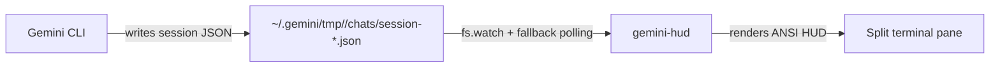

# gemini-hud (v0.5.0)

[English](README.md) | [中文](README_zh.md)

A zero-intrusion terminal companion monitor for Gemini CLI. Run it in a split pane to get a live view of token usage, model, tool activity, and session stats — without modifying or wrapping gemini-cli in any way.

## How It Works

Gemini CLI automatically writes your session history to `~/.gemini/tmp/<project>/chats/session-*.json` as you work. gemini-hud **watches that file** and renders the data in your terminal. No injection, no wrapping, no process hooks.



```
┌─ gemini-hud ──────────────────── [default] 14:32:05 ─┐
│ Session: 25m 3s  ⎇ main                               │
│ Messages: 42  Turns: 18  ● Idle                       │
│ Model: gemini-3-flash-preview                          │
│ Tokens: 45,231 total  (↓38k in / ↑7k out / ⚡12k)    │
│ Tools: write×12  read×8  shell×5                      │
│ Last: "Refactor auth module and update tests"         │
└───────────────────────────────────────────────────────┘
```

## Requirements

- **Node.js 18.0.0+**
- **Gemini CLI** (any version — no special build required)
- A terminal that supports ANSI escape sequences (Windows Terminal, iTerm2, etc.)

## Installation

```bash
git clone https://github.com/your-username/gemini-hud
cd gemini-hud
npm install
```

### Global Install (optional)

```bash
npm install -g .
# Then run from anywhere:
gemini-hud
```

## Quick Start

1. Open a **separate terminal pane** alongside your active `gemini` session.
2. Navigate to your project directory (same directory where you run `gemini`).
3. Run:

```bash
gemini-hud
# or without global install:
node gemini-hud.js
```

gemini-hud will auto-detect your active session and begin displaying metrics immediately.

## CLI Reference

```
gemini-hud [options]

Options:
  --project <name>    Monitor a specific project by name
  --layout  <name>    Layout template: minimal | default | dev
  --theme   <name>    Color theme: default | dark | minimal | ocean | rose
  --notify            Ring bell + system notification when Gemini responds
  --export  <format>  Export session metrics to file (json | csv) and exit
  --version           Print version
  --help              Show this help
```

### Examples

```bash
# Developer layout with ocean theme and notifications
gemini-hud --layout dev --theme ocean --notify

# Compact view in a small pane
gemini-hud --layout minimal --theme dark

# Export current session to JSON (no UI launched)
gemini-hud --export json

# Monitor a specific project
gemini-hud --project my-app
```

## Layouts

| Layout | Rows | What's shown |
| :----- | :--- | :----------- |
| `minimal` | 2 | Session status, model, total tokens — ideal for small panes |
| `default` | 5 | Full info: duration, messages, model, token breakdown, top tools + last message |
| `dev` | 8 | Everything in default, plus: full tool list, git branch, CPU bar, **cross-session history totals** |

## Themes

| Theme | Accent color |
| :---- | :----------- |
| `default` | Blue |
| `dark` | Cyan (high-contrast) |
| `minimal` | Monochrome (no color except status dots) |
| `ocean` | Teal / sky-blue |
| `rose` | Magenta / pink |

## Configuration

Settings are resolved in priority order:

1. **CLI flags** — highest priority (e.g. `--layout dev`)
2. **Project-level** — `.gemini-hudrc` in the current working directory
3. **Global-level** — `~/.gemini-hudrc` in your home directory
4. **Defaults** — built-in values

Copy the example and customize:

```bash
cp .gemini-hudrc.example .gemini-hudrc
```

### Full `.gemini-hudrc` Reference

```json
{
  "hud": {
    "layout": "default",
    "theme": "default",
    "show": {
      "model": true,
      "tokens": true,
      "tools": true,
      "lastMessage": true,
      "time": true,
      "sessionDuration": true
    },
    "maxToolsShown": 5
  },
  "colors": {},
  "performance": {
    "renderFps": 10,
    "pollIntervalMs": 2000,
    "analysisWarnMs": 1000,
    "degradedRenderFps": 2
  },
  "project": {
    "name": null
  }
}
```

### Parameter Reference

#### HUD Display (`hud`)

| Key | Type | Default | Description |
| :-- | :--- | :------ | :---------- |
| `layout` | String | `"default"` | Layout template (`minimal` \| `default` \| `dev`) |
| `theme` | String | `"default"` | Color theme (`default` \| `dark` \| `minimal` \| `ocean` \| `rose`) |
| `show.model` | Boolean | `true` | Show current model name |
| `show.tokens` | Boolean | `true` | Show token usage breakdown |
| `show.tools` | Boolean | `true` | Show tool call history |
| `show.lastMessage` | Boolean | `true` | Show last user message preview |
| `show.time` | Boolean | `true` | Show current time in header |
| `show.sessionDuration` | Boolean | `true` | Show session duration |
| `maxToolsShown` | Number | `5` | Max tools shown in panel |

#### Color Overrides (`colors`)

Per-key ANSI color overrides. Keys match theme roles: `accent`, `label`, `value`, `dim`, `idle`, `processing`, `warn`, `border`. Values are color names (`cyan`, `green`, `red`, etc.) or raw ANSI codes.

```json
{ "colors": { "accent": "magenta", "idle": "bGreen" } }
```

#### Performance (`performance`)

| Key | Type | Default | Description |
| :-- | :--- | :------ | :---------- |
| `renderFps` | Number | `10` | Max UI refresh rate (frames per second) |
| `pollIntervalMs` | Number | `2000` | Fallback file poll interval in milliseconds |
| `analysisWarnMs` | Number | `1000` | Enter degraded mode if one parse takes longer than this |
| `degradedRenderFps` | Number | `2` | UI refresh rate while degraded mode is active |

#### Project (`project`)

| Key | Type | Default | Description |
| :-- | :--- | :------ | :---------- |
| `name` | String | `null` | Default project to monitor (overridden by `--project` flag) |

## What's Displayed

| Field | Description |
| :---- | :---------- |
| **Status** | `● Idle` (green) or `● Processing...` (yellow) |
| **Git branch** | Current git branch in the working directory (auto-detected) |
| **CPU** | System CPU usage % — visible in `dev` layout |
| **Model** | Current model, or `Multi-model` if multiple were used |
| **Tokens** | Cumulative total with breakdown: input / output / cached / thoughts |
| **Tools** | Top N tools by call count this session |
| **Last** | Preview of the most recent user message |
| **Duration** | Time since session start |
| **History** | Cross-session totals (sessions, tokens, turns) — `dev` layout only |

## Export

Export the current session's metrics to a file and exit immediately:

```bash
gemini-hud --export json   # → gemini-hud-export-20260319-143205.json
gemini-hud --export csv    # → gemini-hud-export-20260319-143205.csv
```

The CSV format uses a single header row + one data row, making it easy to append across multiple sessions for trend analysis.

## Notifications (`--notify`)

When `--notify` is active, gemini-hud rings the terminal bell **and** sends a system notification the moment Gemini finishes a response (status transitions from `processing` → `idle`).

| Platform | Mechanism |
| :------- | :-------- |
| macOS | `osascript` — native Notification Center |
| Linux | `notify-send` (falls back to bell) |
| Windows | PowerShell Toast (falls back to bell) |

## Sub-agent Awareness

Gemini CLI may spawn sub-agents within a single session (experimental feature). Each sub-agent writes its own session file with `kind: "subagent"`. gemini-hud always prefers the **main session** (`kind: "main"`) so you see the top-level conversation, not a transient sub-task.

## FAQ

### Does it modify or slow down Gemini CLI?
No. gemini-hud is a passive observer. It only reads files that Gemini CLI already writes — it does not attach to the process, inject code, or send any data to gemini-cli.

### What if I start a new Gemini session?
gemini-hud automatically detects when a new session file appears and switches to monitoring it. Check interval is every 10 seconds.

### Does it work with multiple concurrent Gemini sessions?
gemini-hud monitors one session at a time — whichever is the most recently active main session. Multi-session aggregation is planned for a future release.

### The panel shows "Waiting for Gemini CLI session..."
Start a `gemini` session in the same directory, or use `--project <name>` to specify a project. gemini-hud will detect the session within a few seconds.

### Can I use a theme without changing the config file?
Yes — CLI flags always take priority: `gemini-hud --theme ocean --layout dev`.

## License
MIT License
