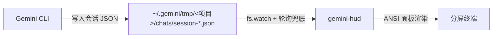

# gemini-hud (v0.5.0)

[English](README.md) | [中文](README_zh.md)

一款零侵入的 Gemini CLI 终端伴侣监控工具。在分屏中运行，即可实时查看 Token 使用量、模型信息、工具调用记录和会话统计 —— 完全不修改、不包裹 gemini-cli。

## 工作原理

Gemini CLI 在你工作时会自动将会话历史写入 `~/.gemini/tmp/<项目名>/chats/session-*.json`。gemini-hud 只是**监听那个文件**，然后在你的终端中渲染数据。没有注入，没有进程包裹，没有钩子。



```
┌─ gemini-hud ────────────────── [default] 14:32:05 ─┐
│ Session: 25m 3s  ⎇ main                             │
│ Messages: 42  Turns: 18  ● 空闲                     │
│ Model: gemini-3-flash-preview                        │
│ Tokens: 45,231 总计  (↓38k 输入 / ↑7k 输出 / ⚡12k) │
│ Tools: write×12  read×8  shell×5                    │
│ Last: "Refactor auth module and update tests"       │
└─────────────────────────────────────────────────────┘
```

## 环境要求

- **Node.js 18.0.0+**
- **Gemini CLI**（任意版本，无需特殊构建）
- 支持 ANSI 转义序列的终端（Windows Terminal、iTerm2 等）

## 安装

```bash
git clone https://github.com/your-username/gemini-hud
cd gemini-hud
npm install
```

### 全局安装（可选）

```bash
npm install -g .
# 之后可在任意目录直接运行：
gemini-hud
```

## 快速开始

1. 在运行 `gemini` 的旁边，**新开一个终端分屏**。
2. 进入你的项目目录（即运行 `gemini` 的那个目录）。
3. 运行：

```bash
gemini-hud
# 或不安装全局命令时：
node gemini-hud.js
```

gemini-hud 会自动检测你的活跃会话，并立即开始展示监控数据。

## 命令行参数

```
gemini-hud [选项]

选项：
  --project <名称>    监控指定项目
  --layout  <名称>    布局模板：minimal | default | dev
  --theme   <名称>    颜色主题：default | dark | minimal | ocean | rose
  --notify            Gemini 回复时响铃并发送系统通知
  --export  <格式>    导出当前 Session 指标到文件后退出（json | csv）
  --version           显示版本号
  --help              显示帮助
```

### 使用示例

```bash
# 开发者布局 + 海洋主题 + 通知
gemini-hud --layout dev --theme ocean --notify

# 小分屏下的极简视图
gemini-hud --layout minimal --theme dark

# 导出当前 Session 为 JSON（不启动 UI）
gemini-hud --export json

# 监控指定项目
gemini-hud --project my-app
```

## 布局模板

| 布局 | 行数 | 显示内容 |
| :--- | :--- | :------- |
| `minimal` | 2 | 状态、模型、总 Token 数 —— 适合小分屏 |
| `default` | 5 | 完整信息：时长、消息数、模型、Token 明细、工具 + 最后消息 |
| `dev` | 8 | default 的全部内容 + 完整工具列表、Git 分支、CPU 占用率、**跨 Session 历史累计** |

## 颜色主题

| 主题 | 强调色 |
| :--- | :----- |
| `default` | 蓝色 |
| `dark` | 青色（高对比度） |
| `minimal` | 单色（状态点除外无颜色） |
| `ocean` | 海蓝色 |
| `rose` | 玫瑰色 / 品红 |

## 配置

配置项按以下优先级依次解析：

1. **命令行参数** —— 最高优先级（如 `--layout dev`）
2. **项目级**：当前工作目录下的 `.gemini-hudrc`
3. **全局级**：用户主目录下的 `~/.gemini-hudrc`
4. **默认值**：内置的默认配置

复制示例文件并自定义：

```bash
cp .gemini-hudrc.example .gemini-hudrc
```

### 完整 `.gemini-hudrc` 配置说明

```json
{
  "hud": {
    "layout": "default",
    "theme": "default",
    "show": {
      "model": true,
      "tokens": true,
      "tools": true,
      "lastMessage": true,
      "time": true,
      "sessionDuration": true
    },
    "maxToolsShown": 5
  },
  "colors": {},
  "performance": {
    "renderFps": 10,
    "pollIntervalMs": 2000,
    "analysisWarnMs": 1000,
    "degradedRenderFps": 2
  },
  "project": {
    "name": null
  }
}
```

### 参数详解

#### HUD 显示配置（`hud`）

| 参数 | 类型 | 默认值 | 说明 |
| :--- | :--- | :----- | :--- |
| `layout` | 字符串 | `"default"` | 布局模板（`minimal` \| `default` \| `dev`） |
| `theme` | 字符串 | `"default"` | 颜色主题（`default` \| `dark` \| `minimal` \| `ocean` \| `rose`） |
| `show.model` | 布尔值 | `true` | 显示当前模型名称 |
| `show.tokens` | 布尔值 | `true` | 显示 Token 用量明细 |
| `show.tools` | 布尔值 | `true` | 显示工具调用历史 |
| `show.lastMessage` | 布尔值 | `true` | 显示最后一条用户消息预览 |
| `show.time` | 布尔值 | `true` | 在标题栏显示当前时间 |
| `show.sessionDuration` | 布尔值 | `true` | 显示会话持续时长 |
| `maxToolsShown` | 数字 | `5` | 面板中最多显示的工具数量 |

#### 颜色覆盖（`colors`）

可按语义角色单独覆盖颜色。可用的键：`accent`、`label`、`value`、`dim`、`idle`、`processing`、`warn`、`border`。值可以是颜色名称（`cyan`、`green` 等）或原始 ANSI 代码。

```json
{ "colors": { "accent": "magenta", "idle": "bGreen" } }
```

#### 性能配置（`performance`）

| 参数 | 类型 | 默认值 | 说明 |
| :--- | :--- | :----- | :--- |
| `renderFps` | 数字 | `10` | 最大 UI 刷新率（帧/秒） |
| `pollIntervalMs` | 数字 | `2000` | 兜底文件轮询间隔（毫秒） |
| `analysisWarnMs` | 数字 | `1000` | 单次解析超过该阈值时进入降级模式 |
| `degradedRenderFps` | 数字 | `2` | 降级模式下的 UI 刷新率 |

#### 项目配置（`project`）

| 参数 | 类型 | 默认值 | 说明 |
| :--- | :--- | :----- | :--- |
| `name` | 字符串 | `null` | 默认监控的项目名称（可被 `--project` 参数覆盖） |

## 显示内容说明

| 字段 | 说明 |
| :--- | :--- |
| **状态（Status）** | `● 空闲`（绿色）或 `● Processing...`（黄色，处理中） |
| **Git 分支** | 工作目录的当前 Git 分支（自动检测） |
| **CPU 占用** | 系统 CPU 使用率 —— 在 `dev` 布局中显示 |
| **模型（Model）** | 当前使用的模型名称；若使用了多个模型则显示 `Multi-model` |
| **Token** | 累计总用量及明细：输入 / 输出 / 缓存 / 思考 |
| **工具（Tools）** | 本会话调用次数最多的前 N 个工具 |
| **最后消息（Last）** | 最近一条用户消息的预览文本 |
| **时长（Duration）** | 自会话开始以来的时间 |
| **历史（History）** | 跨 Session 累计数据（Sessions 数、总 Token、总轮次）—— 仅 `dev` 布局 |

## 数据导出

导出当前 Session 指标到文件并立即退出：

```bash
gemini-hud --export json   # → gemini-hud-export-20260319-143205.json
gemini-hud --export csv    # → gemini-hud-export-20260319-143205.csv
```

CSV 格式采用单行表头 + 单行数据，便于跨多个 Session 追加，方便做趋势分析。

## 通知功能（`--notify`）

启用 `--notify` 后，当 Gemini 完成回复（状态从 `processing` 变为 `idle`）时，gemini-hud 会**响终端铃声**，同时发送系统通知。

| 平台 | 通知方式 |
| :--- | :------- |
| macOS | `osascript` —— 原生通知中心 |
| Linux | `notify-send`（不可用时降级为铃声） |
| Windows | PowerShell Toast（不可用时降级为铃声） |

## Sub-agent 感知

Gemini CLI 在单个 Session 中可能会启动 sub-agent（实验性功能）。每个 sub-agent 都会写入独立的 Session 文件，其 `kind` 字段值为 `"subagent"`。gemini-hud 始终优先选择**主 Session**（`kind: "main"`），确保监控的是顶层对话，而非临时子任务。

## 常见问题

### 会影响或拖慢 Gemini CLI 吗？
不会。gemini-hud 是完全被动的观察者，只读取 Gemini CLI 已经在写入的文件，不附加进程、不注入代码、不发送任何数据给 gemini-cli。

### 如果我重新开启一个新的 Gemini 会话怎么办？
gemini-hud 会自动检测到新的 Session 文件并切换监控目标，检测间隔为每 10 秒一次。

### 支持同时运行多个 Gemini 会话吗？
gemini-hud 目前一次只监控一个会话（最近活跃的主 Session）。多会话聚合功能计划在未来版本中支持。

### 面板显示"Waiting for Gemini CLI session..."
请在同一目录启动 `gemini` 会话，或使用 `--project <名称>` 指定项目，gemini-hud 会在几秒内检测到会话并开始显示数据。

### 不修改配置文件能切换主题吗？
可以 —— 命令行参数优先级最高：`gemini-hud --theme ocean --layout dev`。

## 开源协议
MIT License
