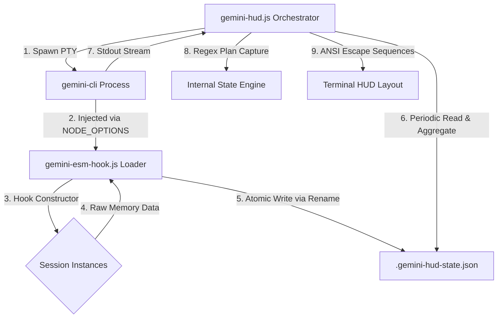

# gemini-hud Technical Specification

## Document Information
| Item | Content |
| :--- | :--- |
| **Project Name** | gemini-hud |
| **Spec Version** | 0.0.3 (Early Iteration) |
| **Status** | Finalized |
| **Core Goal** | High-precision Agent monitoring via memory-level injection |

## 1. System Overview
`gemini-hud` is a high-performance terminal status bar wrapper for `gemini-cli`. It leverages Node.js ESM Loader technology to penetrate the memory of the underlying program, extracting ground-truth data (Tokens, Model IDs, Processing State) without relying solely on fragile terminal output parsing.

## 2. Project Architecture



### 2.1 Module Description
- **Orchestrator (gemini-hud.js)**: The main entry point. It manages the terminal scroll regions, spawns the `gemini-cli` sub-process, and aggregates telemetry from multiple sources.
- **Hook Plugin (gemini-esm-hook.js)**: A specialized ESM Loader that performs bytecode-level source transformation to capture internal class instances.
- **State Bridge (.gemini-hud-state.json)**: A high-speed, I/O-optimized JSON file used as an inter-process communication (IPC) channel.

---

## 3. Implementation Details: The Hook Layer (`gemini-esm-hook.js`)

### 3.1 Injection Mechanism
Must implement the Node.js `load` hook to intercept modules matching `@google/gemini-cli-core`.
- **Transformation**: Injects `globalThis.__HUD_REGISTER_SESSION__(this)` into the `Session` class constructor.
- **Memory Safety**: Uses `WeakRef` and `FinalizationRegistry` to ensure session monitoring does not prevent garbage collection.

### 3.2 I/O Optimization & Atomicity
- **Dirty Checking**: The hook compares the serialized state string before writing. It only hits the disk if the state has actually changed.
- **Atomic Write Strategy**: To prevent race conditions during concurrent read/write:
    1. Write data to a temporary file (`.json.tmp`).
    2. Use `fs.renameSync` to atomically overwrite the target bridge file.

---

## 4. Implementation Details: The Orchestrator Layer (`gemini-hud.js`)

### 4.1 Adherent Layout & PTY
- **Adherence**: On startup, it clears the terminal and repositions the cursor to `(rows - 1)` so that the CLI output appears "glued" to the HUD.
- **Scroll Locking**: Uses ANSI `\x1b[1;Nr` to define a scrolling region that excludes the HUD line.

### 4.2 Aggregation Logic
- **Token Summation**: Sums `input` and `output` tokens from all active sessions found in the bridge file.
- **Model Logic**: If multiple different models are detected across sessions, displays `Multi Gemini Model`.
- **Status Locking**: Only triggers the Regex-based "Plan Capture" engine when the Hook reports that the AI is in a `running` state.

### 4.3 Echo Cancellation
- Buffers user input from `stdin` into an `echoQueue`.
- Filters `stdout` chunks that match the queue head to prevent user-typed content from being parsed as AI-generated plans.

---

## 5. Runtime Requirements
- **Node.js**: v20.0.0+ (Strict requirement for ESM Loader API).
- **Startup Command**:
  ```powershell
  $env:NODE_OPTIONS = "--loader file:///C:/path/to/gemini-esm-hook.js"
  node gemini-hud.js
  ```

## 6. Error Handling & Cleanup
- **Version Guard**: Exit if `node < 20`.
- **Race Conditions**: Handle empty or partial JSON reads during high-frequency updates.
- **Graceful Exit**: Restore scroll region (`\x1b[r`) on `SIGINT` or normal termination.
