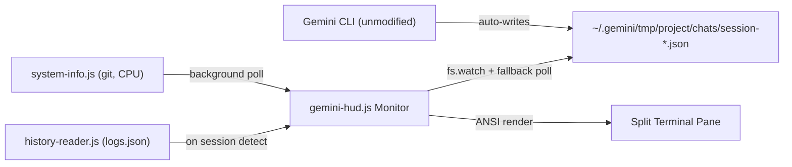
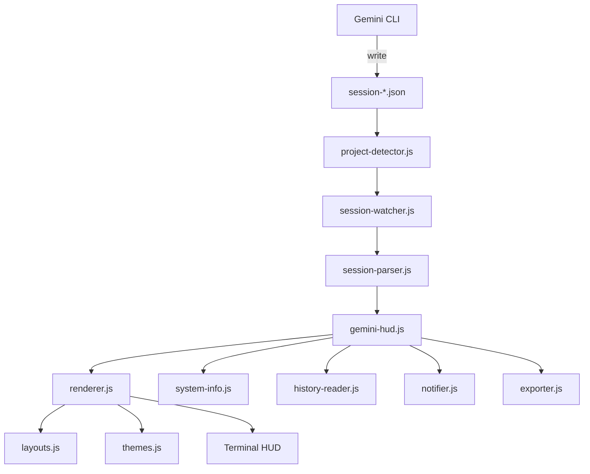

# gemini-hud Technical Specification

## Document Information
| Item | Content |
| :--- | :--- |
| **Project Name** | gemini-hud |
| **Spec Version** | 0.5.0 |
| **Status** | Finalized |
| **Core Goal** | Zero-intrusion Gemini CLI session monitoring via native session file watching |

## 1. System Overview

`gemini-hud` is a lightweight terminal companion monitor for `gemini-cli`. It reads Gemini CLI's native session JSON files — which the CLI writes automatically — to display real-time session metrics without modifying, wrapping, or injecting into the Gemini CLI process in any way.



## 2. Project Architecture



```
gemini-hud/
  gemini-hud.js             -- Main entry point, wires all modules together
  lib/
    project-detector.js     -- Auto-detect active Gemini project; prefers kind:"main"
    session-watcher.js      -- fs.watch + fallback polling on session file
    session-parser.js       -- Parse session JSON, extract metrics
    renderer.js             -- ANSI terminal rendering; delegates to layouts + themes
    layouts.js              -- Three layout templates: minimal / default / dev
    themes.js               -- Five named color themes
    system-info.js          -- Background git branch + CPU usage polling
    history-reader.js       -- Cross-session history aggregation from logs.json
    notifier.js             -- System notifications on status transitions
    exporter.js             -- Export session metrics to JSON or CSV
  test/
    test.js                 -- Unit tests for session-parser.js
  .gemini-hudrc.example     -- Config file template
  package.json
```

### 2.1 Module Descriptions

- **`gemini-hud.js` (Orchestrator)**: Entry point. Parses CLI flags, loads config, starts all background modules, runs render loop. Handles `--export` (one-shot mode) and `--notify` (status-change notifications).
- **`project-detector.js`**: Locates the active session file. Reads only the first 512 bytes of each candidate to check the `kind` field. Prefers `kind: "main"` over `kind: "subagent"` to avoid monitoring transient sub-agent tasks.
- **`session-watcher.js`**: Watches the session file for changes using `fs.watch`. Falls back to `setInterval` polling if `fs.watch` is unavailable.
- **`session-parser.js`**: Parses the full session JSON, aggregates per-turn token data, extracts tool call history, infers processing state, and returns a normalized `SessionMetrics` object.
- **`renderer.js`**: Renders `SessionMetrics` into a multi-line ANSI display. Delegates content rows to `layouts.js` and color resolution to `themes.js`.
- **`layouts.js`**: Three layout templates (`minimal`, `default`, `dev`) each implemented as a pure function `(metrics, sysInfo, theme, width) → string[]`.
- **`themes.js`**: Five named themes, each a map of semantic color roles to ANSI escape codes. Supports per-key override via `colors` config.
- **`system-info.js`**: Background `setInterval` pollers for git branch (`git rev-parse`) and CPU usage (`os.cpus()`). Results are consumed by `renderer.js` on each frame.
- **`history-reader.js`**: Reads `~/.gemini/tmp/<project>/logs.json` and all session files to aggregate cross-session totals (sessions, tokens, turns, tool counts). Loaded once after session detection; displayed in `dev` layout row 8.
- **`notifier.js`**: Fires a system notification and terminal bell (`\x07`) when status transitions from `processing` → `idle`. Uses `osascript` (macOS), `notify-send` (Linux), or PowerShell Toast (Windows).
- **`exporter.js`**: Serializes `SessionMetrics` to JSON (pretty-printed) or CSV (single header + data row). Writes to CWD with a timestamp filename.

---

## 3. Data Source: Gemini CLI Session Files

### 3.1 File Location

```
~/.gemini/tmp/<project-name>/chats/session-<ISO-timestamp>-<uuid>.json
```

The `<project-name>` folder is the basename of the project's root directory. Multiple sessions per project are stored as separate files. The most recently modified file with `kind: "main"` is treated as the active session.

Additionally, `~/.gemini/tmp/<project-name>/logs.json` records all user messages across sessions in a flat array.

### 3.2 Session File Format

```json
{
  "sessionId": "uuid",
  "projectHash": "sha256",
  "startTime": "ISO 8601",
  "lastUpdated": "ISO 8601",
  "kind": "main",
  "messages": [
    {
      "id": "uuid",
      "timestamp": "ISO 8601",
      "type": "user",
      "content": [{ "text": "user prompt" }]
    },
    {
      "id": "uuid",
      "timestamp": "ISO 8601",
      "type": "gemini",
      "content": "assistant response text",
      "thoughts": [
        { "subject": "...", "description": "...", "timestamp": "ISO 8601" }
      ],
      "tokens": {
        "input": 6079,
        "output": 52,
        "cached": 0,
        "thoughts": 62,
        "tool": 0,
        "total": 6193
      },
      "model": "gemini-3-flash-preview",
      "toolCalls": [
        {
          "id": "tool_call_id",
          "name": "read_file",
          "args": { "file_path": "src/main.js" },
          "result": [],
          "status": "success",
          "timestamp": "ISO 8601",
          "displayName": "ReadFile"
        }
      ]
    }
  ]
}
```

### 3.3 Session `kind` Field

Gemini CLI uses the `kind` field to distinguish session types:

| Value | Meaning |
| :---- | :------ |
| `"main"` | Top-level interactive session |
| `"subagent"` | Sub-agent spawned within a parent session (experimental) |
| absent | Older builds without sub-agent support — treated as `"main"` |

**Note**: Due to a known bug ([#20258](https://github.com/google-gemini/gemini-cli/issues/20258)), sub-agents may currently write to the same filename as their parent. gemini-hud's kind-detection logic (reading only the first 512 bytes) handles this correctly by always preferring `kind: "main"` files.

### 3.4 Key Data Points Available

| Data | Source Field | Notes |
| :--- | :--- | :--- |
| Model name | `message.model` | Per-turn; may vary across turns |
| Input tokens | `message.tokens.input` | Per-turn; accumulate for session total |
| Output tokens | `message.tokens.output` | Per-turn |
| Cached tokens | `message.tokens.cached` | Per-turn |
| Thought tokens | `message.tokens.thoughts` | Per-turn |
| Total tokens | `message.tokens.total` | Per-turn |
| Tool calls | `message.toolCalls[].name` | Name, args, status per call |
| Session start | `startTime` | Top-level field |
| Last update | `lastUpdated` | Top-level field |
| Session kind | `kind` | `"main"` or `"subagent"` |
| Message count | `messages.length` | Includes both user and gemini types |

---

## 4. Implementation Details

### 4.1 Project Detection (`project-detector.js`)

Priority order for finding the active session:

1. **`--project <name>` flag**: Use `~/.gemini/tmp/<name>/` directly.
2. **CWD matching**: Scan all `.project_root` files under `~/.gemini/tmp/*/` and find the one whose content matches `process.cwd()`.
3. **Most recently modified**: If no match, pick the project folder with the most recently modified `chats/session-*.json`.

**Kind preference** applied at all stages:
- Read the first 512 bytes of each candidate file to extract the `kind` field cheaply.
- Within a `chats/` directory, sort by mtime descending, then return the newest `kind: "main"` file (or `kind: null` for old builds). Only fall back to `kind: "subagent"` if no main session exists.
- Across all projects, apply the same preference globally.

### 4.2 Session Watching (`session-watcher.js`)

- Uses `fs.watch(filePath, callback)` as the primary mechanism.
- If `fs.watch` fires with `eventType === 'rename'` (file replaced atomically), re-attaches the watcher.
- Fallback: if `fs.watch` is unavailable or throws, falls back to `setInterval` polling every `performance.pollIntervalMs` (default 2000ms).
- On each change event, triggers `session-parser.js` to re-parse the file.

### 4.3 Session Parsing (`session-parser.js`)

Parses the full session JSON and returns a `SessionMetrics` object:

```javascript
{
  sessionId: string,
  sessionStart: Date,
  lastUpdated: Date,
  durationMs: number,
  messageCount: number,         // total messages
  turnCount: number,            // gemini-type messages only
  model: string,                // last model used, or "Multi-model" if mixed
  models: Set<string>,          // all models seen
  tokens: {
    input: number,              // cumulative
    output: number,
    cached: number,
    thoughts: number,
    total: number
  },
  tools: Map<string, number>,   // toolName -> call count
  lastUserMessage: string,
  lastGeminiMessage: string,
  status: 'idle' | 'processing' | 'unknown',
  processingForMs: number
}
```

**Status inference**:
- Last message `type: "user"` and `Date.now() - timestamp < 10 min` → `"processing"`
- Last message `type: "gemini"` → `"idle"`
- Otherwise → `"unknown"`

### 4.4 Rendering (`renderer.js`, `layouts.js`, `themes.js`)

#### Render cycle

1. On startup: print the initial panel, record cursor position.
2. On each update: move cursor back to panel start (`\x1b[<N>A`), overwrite each line, erase to end of line. Dirty-check skips unchanged frames.

#### Layouts

| Layout | Content rows | Key additions vs. previous tier |
| :----- | :----------- | :------------------------------- |
| `minimal` | 2 | Status, model, total tokens |
| `default` | 5 | + duration, message counts, token breakdown, tools/last message |
| `dev` | 8 | + full tool list, git branch, CPU bar, cross-session history row |

Layout functions signature: `(metrics, sysInfo, theme, width) → string[]`
where `sysInfo = { gitBranch, cpuPercent, historyStats }`.

#### Themes

Five built-in themes (`default`, `dark`, `minimal`, `ocean`, `rose`), each providing semantic color roles: `accent`, `label`, `value`, `dim`, `idle`, `processing`, `warn`, `border`.

Per-key overrides via the `colors` config object are merged on top of the base theme at runtime.

### 4.5 System Info (`system-info.js`)

Two background pollers started at process launch:

- **Git branch**: `exec('git rev-parse --abbrev-ref HEAD', { cwd, timeout: 2000 })` every 5 seconds.
- **CPU usage**: Samples `os.cpus()` delta every 2 seconds, computes `100 * (total - idle) / total`.

Both are read synchronously by the render loop via `getGitBranch()` and `getCpuPercent()`.

### 4.6 History Stats (`history-reader.js`)

Loaded once after the active session is detected (and again if the session switches):

1. Read `~/.gemini/tmp/<project>/logs.json` → total message count, earliest timestamp.
2. Read all `session-*.json` files in `chats/` → accumulate total tokens, turns, tool call counts.

Displayed in the `dev` layout's Row 8 as: `History: sessions: N  total tokens: XM  turns: Y`.

### 4.7 Notifications (`notifier.js`)

Triggered when `--notify` flag is set and status transitions `processing → idle`:

1. Write `\x07` to stdout (terminal bell — universal).
2. Platform-specific system notification:
   - **macOS**: `osascript -e 'display notification ...'`
   - **Linux**: `notify-send`
   - **Windows**: PowerShell `[Windows.UI.Notifications...]`
3. All calls are fire-and-forget (`exec` with timeout, errors silently ignored).

### 4.8 Export (`exporter.js`)

Invoked by `--export <format>` before the render loop starts:

- **JSON**: Pretty-printed object with all `SessionMetrics` fields + export timestamp.
- **CSV**: Single header row + single data row. Fields: `exportedAt`, `project`, `sessionId`, `sessionStart`, `durationMs`, `messageCount`, `turnCount`, `status`, `model`, token columns, `topTool`, `topToolCount`.

Output filename: `gemini-hud-export-<YYYYMMDD-HHmmss>.<ext>` in CWD.

### 4.9 Configuration (`.gemini-hudrc`)

Resolved in priority order:

1. CLI flags (`--layout`, `--theme`) — highest
2. Project-level: `.gemini-hudrc` in CWD
3. Global-level: `~/.gemini-hudrc`
4. Built-in defaults

```json
{
  "hud": {
    "layout": "default",
    "theme": "default",
    "show": {
      "model": true,
      "tokens": true,
      "tools": true,
      "lastMessage": true,
      "time": true,
      "sessionDuration": true
    },
    "maxToolsShown": 5
  },
  "colors": {},
  "performance": {
    "renderFps": 10,
    "pollIntervalMs": 2000
  },
  "project": {
    "name": null
  }
}
```

---

## 5. CLI Interface

```
gemini-hud [options]

--project <name>    Monitor a specific project by name
--layout  <name>    Layout: minimal | default | dev
--theme   <name>    Theme: default | dark | minimal | ocean | rose
--notify            Bell + system notification on processing→idle transition
--export  <format>  Export metrics to json or csv, then exit
--version           Print version (reads from package.json)
--help              Show usage
```

---

## 6. Runtime Requirements

- **Node.js**: v18.0.0+ (uses `fs.watch`, `fs/promises`, ESM, `fs.open` for partial reads)
- **Gemini CLI**: Any version that writes to `~/.gemini/tmp/`
- **No additional npm packages required** (only `ansi-escapes` and `strip-ansi` as optional helpers)

## 7. Error Handling & Cleanup

- **No session found**: Display "Waiting for Gemini CLI session..." and keep polling for new files.
- **File read errors**: Log warning, retry on next poll cycle. Never crash.
- **Graceful exit**: On `SIGINT` / `SIGTERM`, stop all pollers, clear the panel, restore cursor visibility (`\x1b[?25h`).
- **Session rotation**: When Gemini CLI starts a new session (new file appears), automatically switch to the newer file within 10 seconds.
- **Sub-agent files**: Detected by `kind` field check; excluded from main monitoring unless no main session exists.

## 8. Known Limitations

| Limitation | Notes |
| :--------- | :---- |
| Sub-agent session collision bug | Gemini CLI bug [#20258](https://github.com/google-gemini/gemini-cli/issues/20258) causes sub-agents to occasionally overwrite the parent's session file. gemini-hud mitigates by checking `kind` on each rescan. |
| Status inference only on file update | `processing` status is inferred from timestamps, not live process state. Status updates only when the session file changes (on turn completion). |
| Single-session monitoring | Only one session is monitored at a time. Multi-session aggregation is not yet implemented. |
| History load performance | Loading history scans all session files for the project synchronously. Large projects with many sessions may see a brief delay on startup. |
