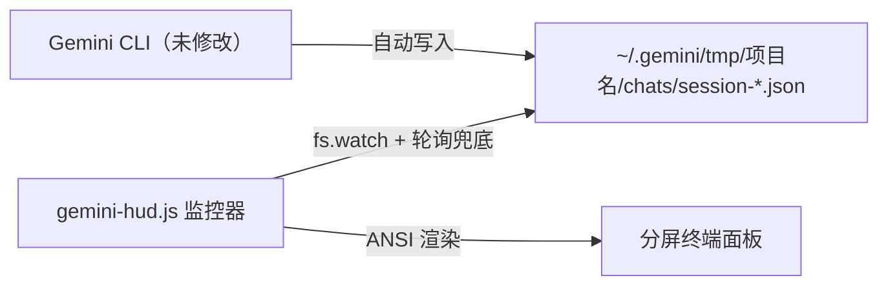
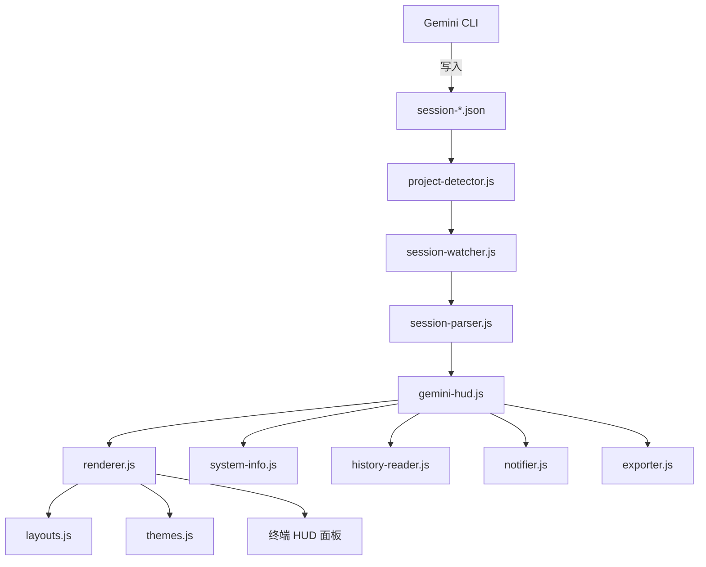

# gemini-hud 技术规格说明书

## 文档信息
| 项 | 内容 |
| :--- | :--- |
| **项目名称** | gemini-hud |
| **Spec 版本** | 0.5.0（终端伴侣监控器） |
| **当前状态** | 已定稿 |
| **核心目标** | 通过监听原生 Session 文件，实现对 Gemini CLI 的零侵入状态监控 |

## 1. 系统概述

`gemini-hud` 是一款为 `gemini-cli` 设计的轻量级终端伴侣监控工具。它通过读取 Gemini CLI **自动写入**的原生 Session JSON 文件，实时展示会话指标，全程**不修改、不包裹、不注入** Gemini CLI 进程。



## 2. 项目架构



```
gemini-hud/
  gemini-hud.js           -- 主入口，连接所有模块
  lib/
    project-detector.js   -- 自动检测活跃的 Gemini 项目目录
    session-watcher.js    -- fs.watch + 轮询兜底，监听 Session 文件变化
    session-parser.js     -- 解析 Session JSON，提取监控指标
    renderer.js           -- ANSI 终端渲染，用于分屏面板
  .gemini-hudrc.example   -- 配置文件模板
  package.json
```

### 2.1 模块说明

- **`gemini-hud.js`（编排器）**：入口文件。调用项目检测器，启动 Session 监听器，启动渲染循环。
- **`project-detector.js`**：通过扫描 `~/.gemini/tmp/` 定位活跃的 Session 文件。支持基于 CWD 的自动检测，以及 `--project <name>` 参数覆盖。
- **`session-watcher.js`**：使用 `fs.watch` 监听 Session 文件变化；当 `fs.watch` 不可用时（如网络驱动器、部分 Windows 环境），自动退回到 `setInterval` 轮询模式。
- **`session-parser.js`**：解析 Session JSON，聚合 Token 数据，提取工具调用历史，推断处理状态，并返回标准化的 `SessionMetrics` 对象。
- **`renderer.js`**：将 `SessionMetrics` 渲染为多行 ANSI 显示面板，通过光标重定位实现原地刷新（无闪烁）。

---

## 3. 数据来源：Gemini CLI Session 文件

### 3.1 文件位置

```
~/.gemini/tmp/<项目名>/chats/session-<ISO时间戳>-<uuid>.json
```

`<项目名>` 是项目根目录的 basename。同一项目的多个 Session 会存储为不同文件，最近修改的文件视为活跃 Session。

另外，`~/.gemini/tmp/<项目名>/logs.json` 记录了跨 Session 的所有用户消息，以扁平数组的形式存储。

### 3.2 Session 文件格式

每个文件是一个完整的 JSON 对象：

```json
{
  "sessionId": "uuid",
  "projectHash": "sha256",
  "startTime": "ISO 8601",
  "lastUpdated": "ISO 8601",
  "kind": "main",
  "messages": [
    {
      "id": "uuid",
      "timestamp": "ISO 8601",
      "type": "user",
      "content": [{ "text": "用户提示词" }]
    },
    {
      "id": "uuid",
      "timestamp": "ISO 8601",
      "type": "gemini",
      "content": "助手回复文本",
      "thoughts": [
        { "subject": "...", "description": "...", "timestamp": "ISO 8601" }
      ],
      "tokens": {
        "input": 6079,
        "output": 52,
        "cached": 0,
        "thoughts": 62,
        "tool": 0,
        "total": 6193
      },
      "model": "gemini-3-flash-preview",
      "toolCalls": [
        {
          "id": "tool_call_id",
          "name": "read_file",
          "args": { "file_path": "src/main.js" },
          "result": [...],
          "status": "success",
          "timestamp": "ISO 8601",
          "displayName": "ReadFile"
        }
      ]
    }
  ]
}
```

### 3.3 可获取的关键数据

| 数据 | 来源字段 | 说明 |
| :--- | :--- | :--- |
| 模型名称 | `message.model` | 每轮均有；不同轮次可能不同 |
| 输入 Token | `message.tokens.input` | 每轮；累加得会话总量 |
| 输出 Token | `message.tokens.output` | 每轮 |
| 缓存 Token | `message.tokens.cached` | 每轮 |
| 思考 Token | `message.tokens.thoughts` | 每轮 |
| 总 Token | `message.tokens.total` | 每轮 |
| 工具调用 | `message.toolCalls[].name` | 名称、参数、状态 |
| 会话开始时间 | `startTime` | 顶层字段 |
| 最后更新时间 | `lastUpdated` | 顶层字段 |
| 消息数量 | `messages.length` | 包括 user 和 gemini 两种类型 |

---

## 4. 实现细节

### 4.1 项目检测（`project-detector.js`）

活跃 Session 的查找优先级：

1. **`--project <name>` 参数**：直接使用 `~/.gemini/tmp/<name>/`。
2. **CWD 匹配**：扫描 `~/.gemini/tmp/*/` 下的所有 `.project_root` 文件，找到内容与 `process.cwd()` 匹配的条目。
3. **最近修改**：若无匹配，则选取 `chats/session-*.json` 修改时间最新的项目目录。

返回活跃 Session 文件的完整路径。

### 4.2 Session 监听（`session-watcher.js`）

- 主要机制：`fs.watch(filePath, callback)`。
- 若 `fs.watch` 触发 `rename` 事件（文件被原子替换），则重新挂载监听器。
- 兜底机制：若 `fs.watch` 不可用或报错，退回到 `setInterval` 轮询，轮询间隔为 `performance.pollIntervalMs`（默认 2000ms）。
- 每次变更事件触发时，调用 `session-parser.js` 重新解析文件。
- 同时监听父目录 `chats/`，以感知新 Session 文件的创建（处理会话重启情况）。

### 4.3 Session 解析（`session-parser.js`）

解析完整的 Session JSON，返回 `SessionMetrics` 对象：

```javascript
{
  sessionId: string,
  sessionStart: Date,
  lastUpdated: Date,
  durationMs: number,
  messageCount: number,         // 消息总数
  turnCount: number,            // 仅 gemini 类型的消息数
  model: string,                // 最后使用的模型，或 "Multi-model"（若有多个）
  models: Set<string>,          // 所有出现过的模型
  tokens: {
    input: number,              // 累计值
    output: number,
    cached: number,
    thoughts: number,
    total: number
  },
  tools: Map<string, number>,   // 工具名 -> 调用次数
  lastUserMessage: string,      // 最后一条用户提示词文本
  lastGeminiMessage: string,    // 最后一条 gemini 回复文本
  status: 'idle' | 'processing' | 'unknown',
  processingForMs: number       // 当 status=processing 时，表示等待了多少毫秒
}
```

**状态推断逻辑**：
- 若最后一条消息是 `type: "user"`，且时间戳距今 < 10 分钟：`status = 'processing'`
- 若最后一条消息是 `type: "gemini"`：`status = 'idle'`
- 否则：`status = 'unknown'`

**性能说明**：3MB / 260 条消息的 Session 文件在普通机器上解析耗时约 29ms，完全满足按需重解析的需求。

### 4.4 渲染（`renderer.js`）

在终端中渲染固定的多行面板。仅使用 ANSI 转义序列，不依赖外部 UI 库。

**渲染周期**：
1. 启动时：打印初始面板，记录光标位置。
2. 每次更新时：将光标上移至面板顶部（`\x1b[<N>A`），用新内容逐行覆写（每行末尾加 `\x1b[K` 清除残余字符），再将光标移回底部。

**面板布局**（默认）：

```
┌─ gemini-hud ────────────────────────────────── 14:32:05 ─┐
│ Session: 25分42秒  │  Messages: 42  │  Turns: 18         │
│ Model: gemini-3-flash-preview                             │
│ Status: ● 空闲                                            │
│ Tokens: 45,231 总计  (↓38k 输入 / ↑7k 输出 / ⚡12k 缓存) │
│ Tools: write_file×12  read_file×8  shell×5               │
│ Last: "Refactor auth module and update tests"             │
└───────────────────────────────────────────────────────────┘
```

**颜色方案**：
- `idle`：绿色（`\x1b[32m`）
- `processing`：蓝色（`\x1b[34m`）
- `unknown`：黄色（`\x1b[33m`）
- `error`：红色（`\x1b[31m`）

**渲染节流**：最大渲染频率由 `performance.renderFps` 控制（默认 10fps = 100ms）。脏检查：若 `SessionMetrics` 自上次渲染以来未发生变化，则跳过本次渲染。

### 4.5 配置文件（`.gemini-hudrc`）

优先级从高到低依次解析：
1. 项目级：CWD 下的 `.gemini-hudrc`
2. 全局级：`~/.gemini-hudrc`
3. 内置默认值

```json
{
  "hud": {
    "show": {
      "model": true,
      "tokens": true,
      "tools": true,
      "lastMessage": true,
      "time": true,
      "sessionDuration": true
    },
    "colors": {
      "idle": "\u001b[32m",
      "processing": "\u001b[34m",
      "error": "\u001b[31m"
    },
    "maxToolsShown": 5
  },
  "performance": {
    "renderFps": 10,
    "pollIntervalMs": 2000
  },
  "project": {
    "name": null
  }
}
```

---

## 5. 运行环境要求

- **Node.js**：v18.0.0+（使用 `fs.watch`、`fs/promises`、ESM）
- **Gemini CLI**：任何会写入 `~/.gemini/tmp/` 的版本（已知所有版本均支持）
- **无需额外安装**：除 `ansi-escapes` 和 `strip-ansi` 外，无其他 npm 依赖

## 6. 使用方式

```bash
# 根据当前目录自动检测活跃 Session
node gemini-hud.js

# 监控指定项目
node gemini-hud.js --project my-project

# 查看帮助
node gemini-hud.js --help
```

在**独立的终端分屏**中运行 `gemini-hud`，与活跃的 `gemini` 会话并排显示。监控器完全被动运行，不与 CLI 进程发生任何交互。

## 7. 错误处理与清理

- **未找到 Session**：显示"等待 Gemini CLI 会话..."，并持续监听新文件创建。
- **文件读取错误**：记录警告，在下次轮询周期中重试。程序不会崩溃。
- **优雅退出**：收到 `SIGINT` / `SIGTERM` 时，清除面板并恢复光标显示（`\x1b[?25h`）。
- **Session 轮换**：当 Gemini CLI 开启新会话（创建新文件）时，自动切换为监控更新的文件。
